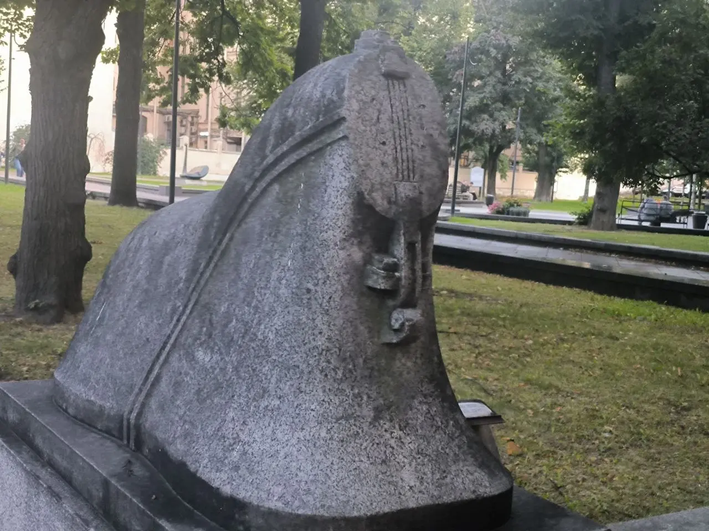
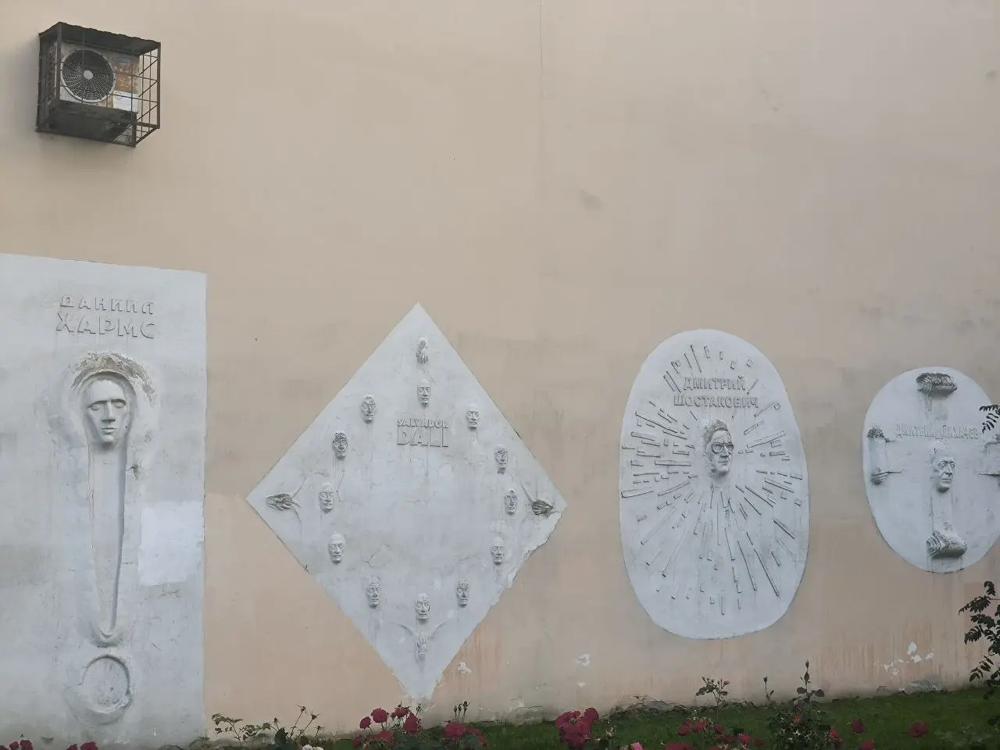
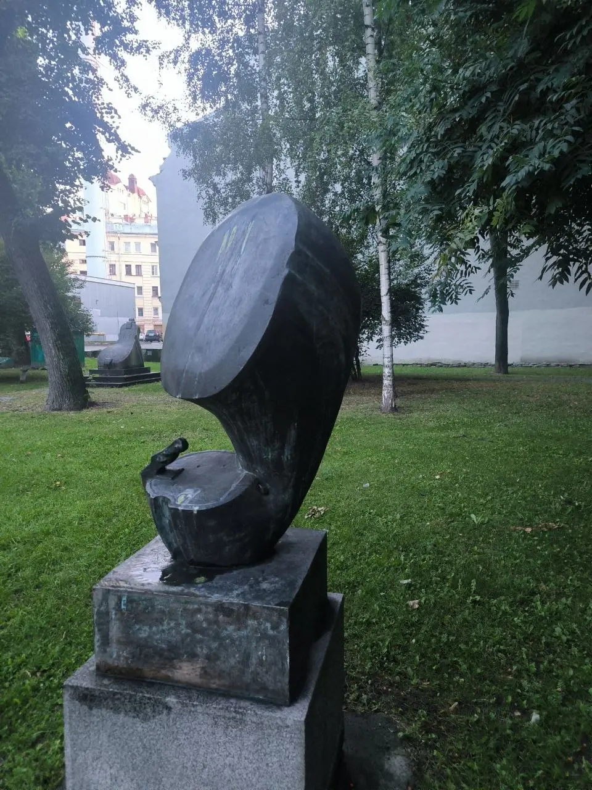
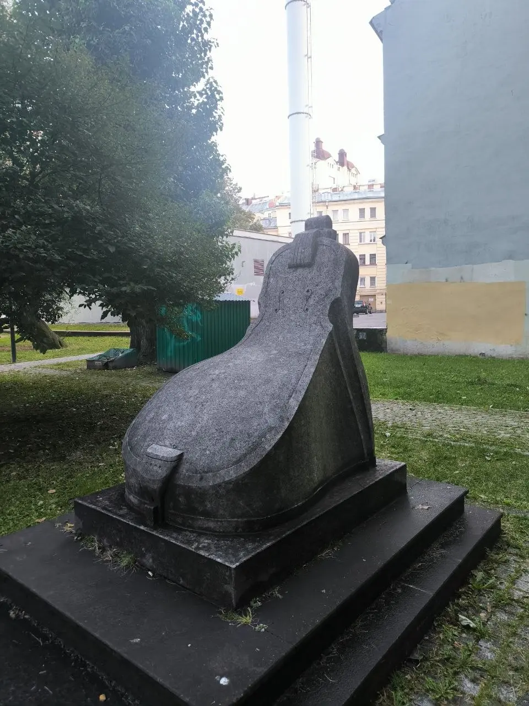
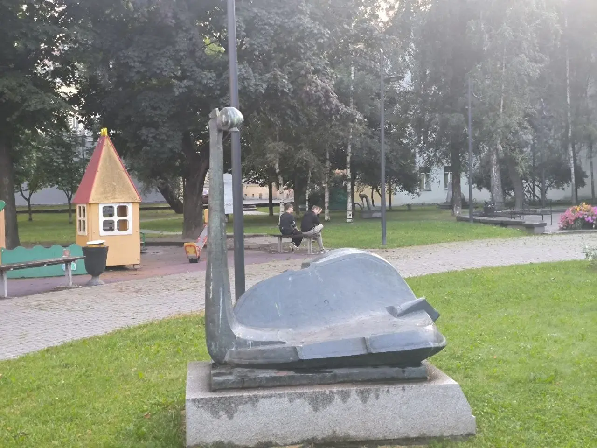
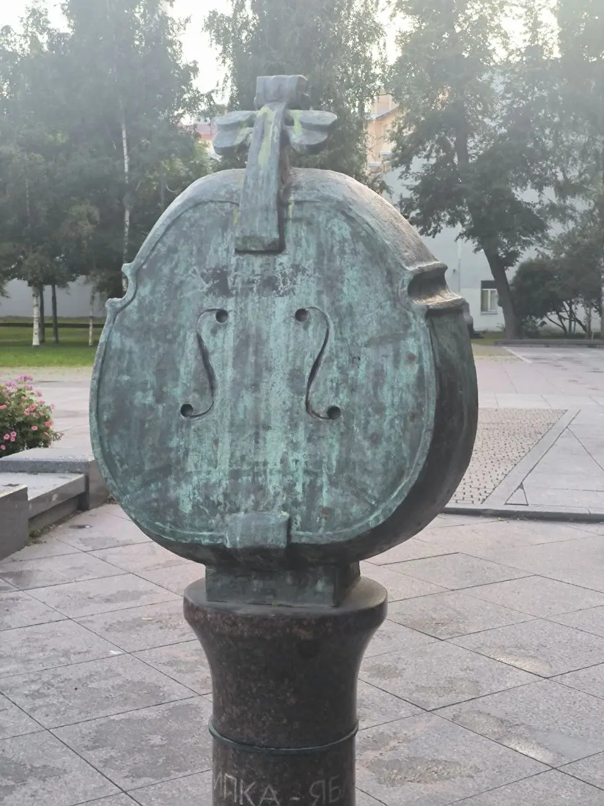
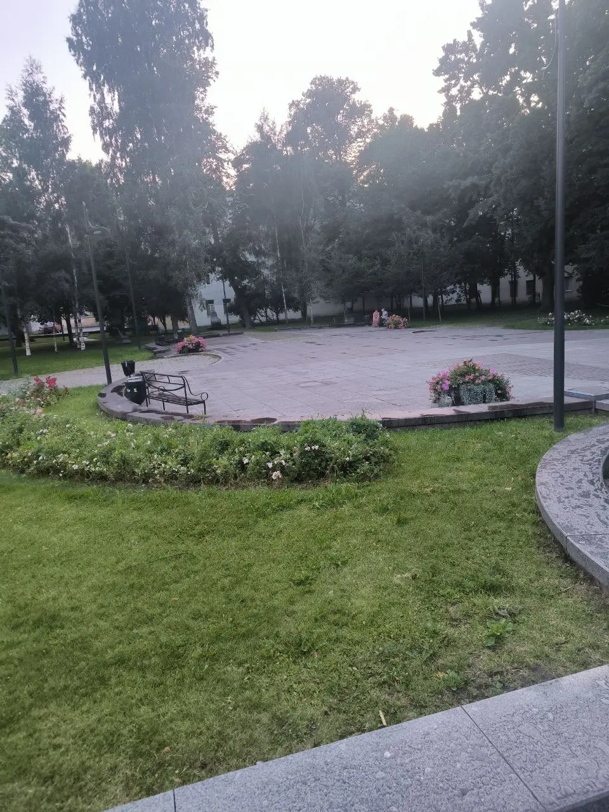
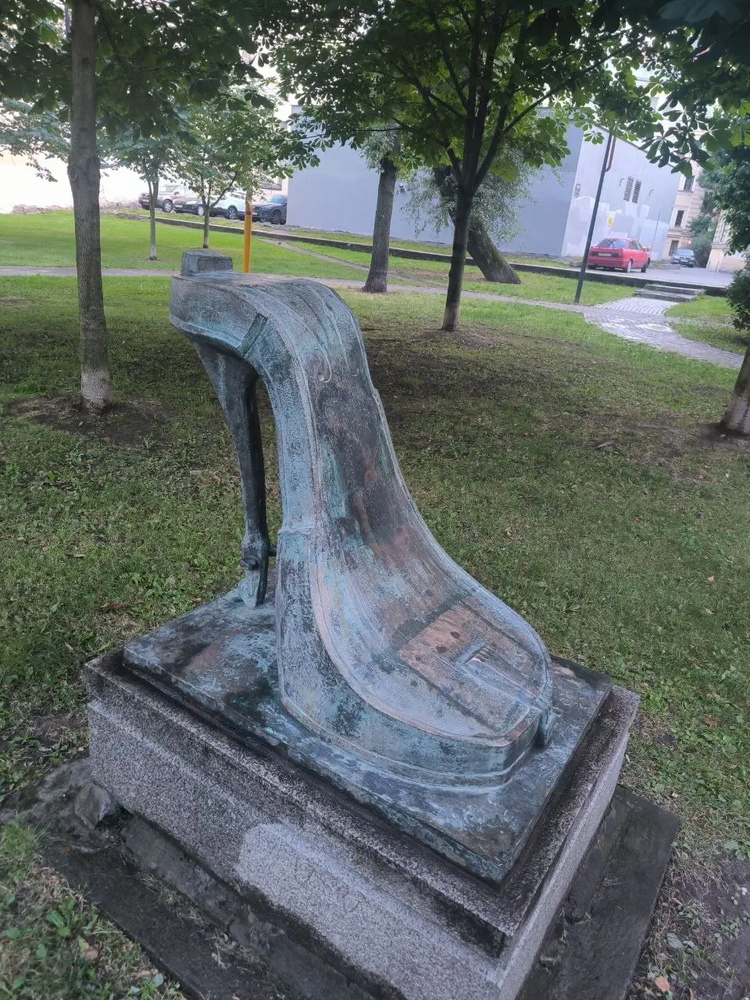
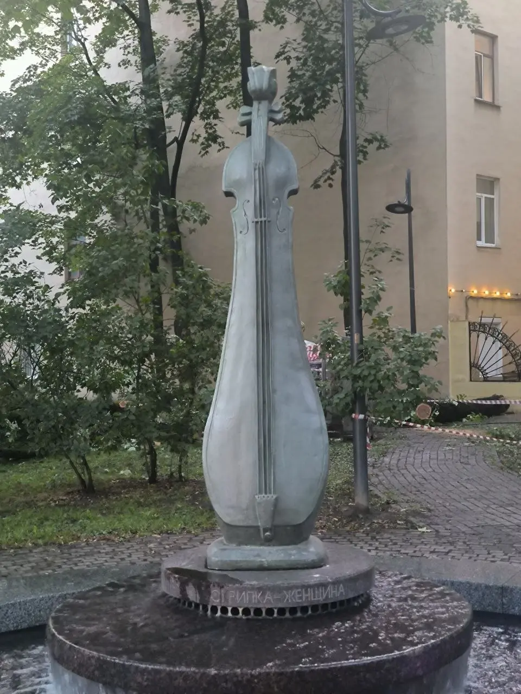

:::gallery
{width="1280" height="960" data-color="#646560"}

{width="1280" height="960" data-color="#a6a29d"}

{width="960" height="1280" data-color="#4a5954"}

{width="960" height="1280" data-color="#5d6360"}

{width="1280" height="960" data-color="#85887d"}

{width="960" height="1280" data-color="#84898a"}

{width="960" height="1280" data-color="#656b5f"}

{width="960" height="1280" data-color="#5e6763"}

{width="960" height="1280" data-color="#61635d"}
:::

Расскажу про место в Петербурге, где количество скрипок на метр² растёт экспоненциально!

Когда прогуливаюсь по Петроградке в сторону Австрийской площади, обязательно захожу!

В 2005 году в рамках акции по спасению сквера петербургский композитор Андрей Петров посадил здесь рябину. После его смерти сад был назван в его честь.

В 2008 году сквер открыли после благоустройства. Его украсили восемь скульптур, изображающих разные трансформации скрипки — любимого инструмента композитора.

**Итак, вашему вниманию, следующие морфологические химеры:**
**Скрипка-яблоко, Скрипка-туфелька, Скрипка-женщина (Муза композитора), Скрипка-кресло (Трон Композитора), Скрипка-лебедь (Реквием), Скрипка-граммофон, Скрипки-сфинксы.**

В южной части сада расположена композиция «Стена столетий» с барельефами, посвящёнными...[всех узнали](https://t.me/gattavasis/572)??😁

Когда будете в Петербурге, обязательно заглядывайте! А у меня остались считанные свободные денёчки дома, будете в наших краях — маякните❤️
Ваш доморощенный экскурсовод
