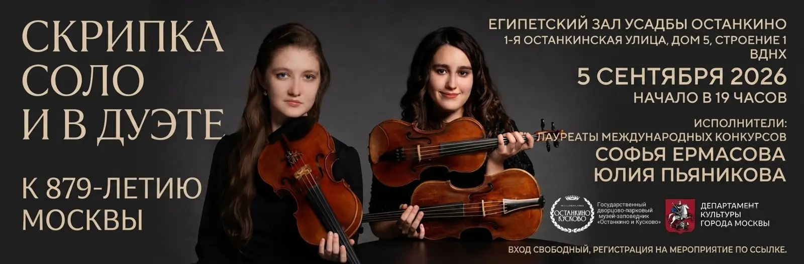
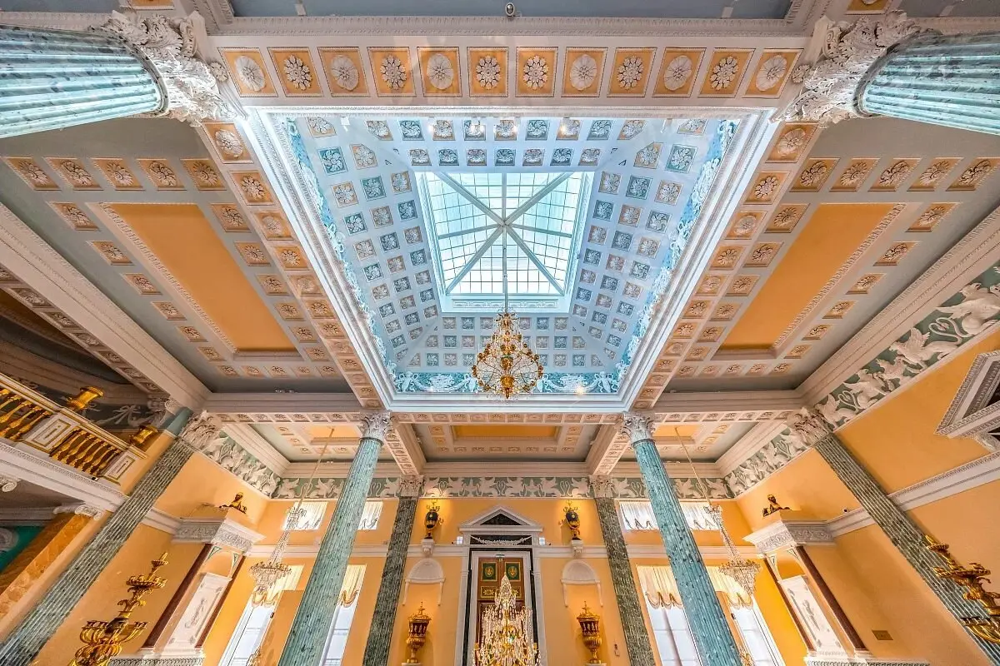
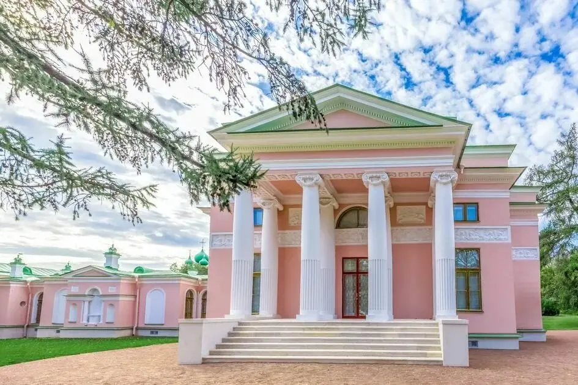
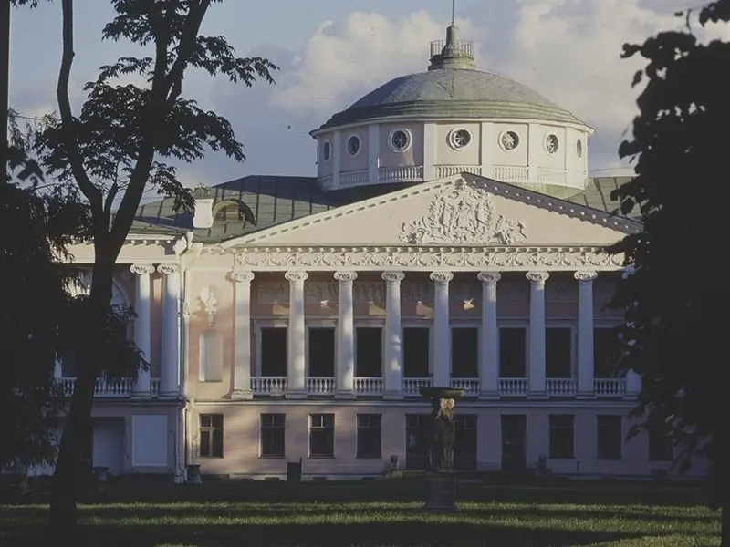
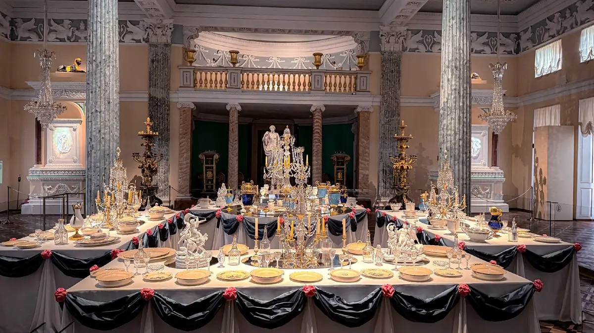
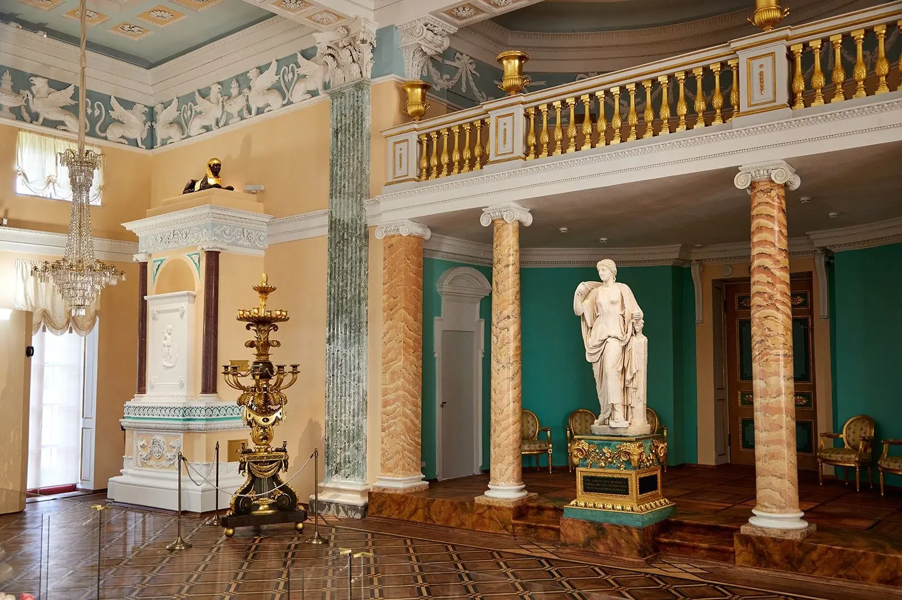

:::gallery
{width="1600" height="527" data-color="#372d28"}

{width="1200" height="800" data-color="#a6907c"}

{width="945" height="630" data-color="#aeacaa"}

{width="800" height="600" data-color="#5d5b5b"}

{width="1200" height="675" data-color="#786359"}

{width="1600" height="1067" data-color="#867259"}
:::

**5 сентября**, **в День рождения Москвы**, приглашаю вас сбежать от праздничной суеты в одно из самых изысканных пространств столицы — недавно открывшийся после реставрации [Египетский павильон усадьбы «Останкино»](https://t.me/gattavasis/595?single)!

Больше десяти лет павильон был закрыт, а теперь, после ювелирной работы реставраторов, мы вновь можем услышать музыку в его исторических интерьерах.

В этот день выйду на сцену с замечательной скрипачкой, **ассистентом моего профессора в консерватории,** [Софьей Ермасовой](https://vk.ru/ermasovasofia)!

Мы представим программу **«Скрипка соло и в дуэте»,** в общем, вы поняли, только скрипка и ничего лишнего😁

📍​ [Музей-усадьба «Останкино», Египетский павильон](https://yandex.ru/maps/org/muzey_usadba_ostankino/50561763012?si=hkgv88xffz97ba3h76tajv9ey0)

5 сентября 19:00

​ В конце XVIII века граф Николай Шереметев решил построить  грандиозный дворец-театр ради своей возлюбленной — гениальной крепостной актрисы Прасковьи Жемчуговой. Главный архитектурный фокус в том, что весь дворец возведен **из обычной сибирской сосны**, но оштукатурен и покрашен так искусно, что выглядит как тяжелый каменный палаццо.

Сердце восточного крыла — Египетский павильон, спроектированный любимым архитектором Павла I Винченцо Бренной на волне всеевропейской истерии по восточной экзотике — спасибо Наполеону.

Убранство поражает воображение: пространство украшают изящные колонны с капителями в виде цветков лотоса, рельефные изображения сфинксов,  лепной декор и печи с фигурными барельефами. Серо-голубые и бледно-желтые тона кессонированного потолка, сложнейшая позолота, искусственный мрамор и больше 700 квадратных метров восстановленного вручную художественного паркета создают абсолютный эффект присутствия в античном храме искусства.
​
