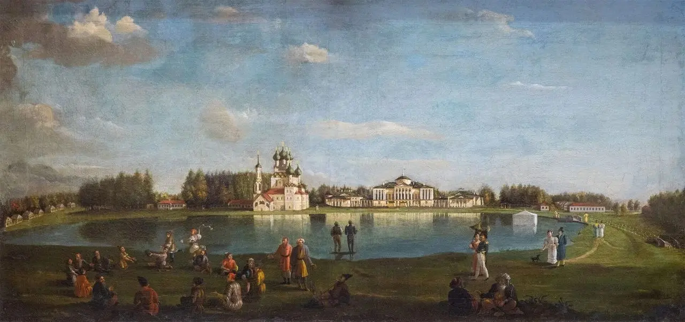
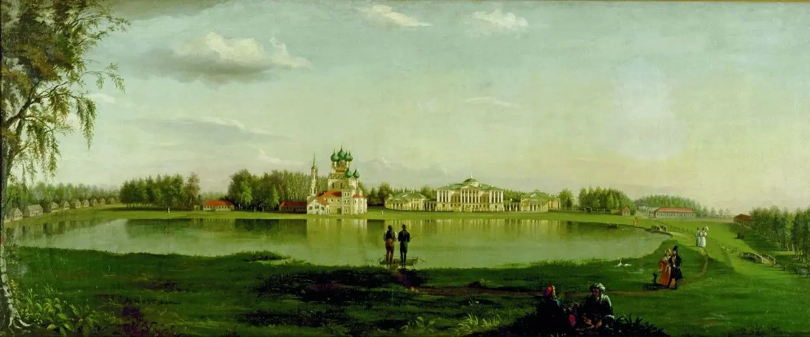
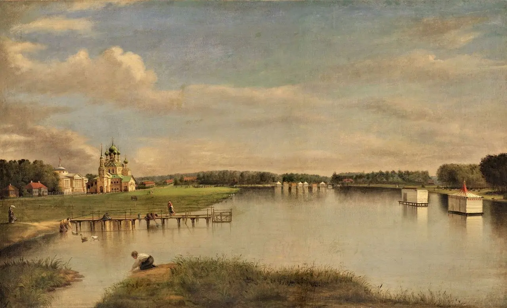

:::gallery
{width="1280" height="602" data-color="#787b77"}

{width="1280" height="534" data-color="#8b9968"}

{width="1280" height="777" data-color="#9a8563"}
:::

Дорогие друзья,
Делюсь [ссылкой для регистрации на концерт](https://bilet.mos.ru/event/705547257/) ко дню рождения Москвы, который состоится 5 сентября в Египетском павильоне усадьбы Останкино. Представим полностью скрипичную программу с [Софьей Ермасовой](https://vk.ru/ermasovasofia)!

До встречи!
\_\_\_\_
**Николай Иванович Подключников** (1813–1877) — русский живописец и художник-реставратор, происходивший из семьи потомственных художников и иконописцев, крепостных графа Д. Н. Шереметева; создал несколько работ с видами усадьбы Останкино.

1833 год — **«Вид усадьбы Останкино»**,
1836 год —**«Усадьба графов Шереметевых Останкино. Вид из-за пруда на дворец и церковь»**,
1850-е годы — **«Вид Останкина».**
