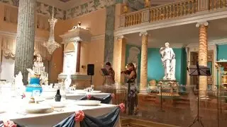
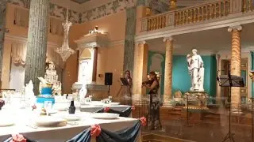

[{width="320" height="180" data-color="#937c64"}](https://t.me/gattavasis/610){.video data-duration="51"}

Кстати, Альфред Шнитке написал первую версию (для двух скрипок) «Moz-Art», соч.111 ровно 50 лет назад, в 1976 году.

«Moz-Art» — цикл пьес для разных инструментальных составов, созданный в период с 1975 по 1990 год на основе фрагментов скрипичной партии из утерянной партитуры Вольфганга Амадея Моцарта — музыки к пантомиме 1783 года, в которой Моцарт сам исполнял роль Арлекина.

Шнитке рассматривал разные варианты названий для цикла, включая «Случайные соединения тем Моцарта», «Подлинная подделка под Моцарта» и «Бемоль, изъеденный молью». Произведение имеет подзаголовок **«Проект реконструкции наполовину утерянного произведения».**

🎻🎻🎻

🌟**А** [уже завтра исполню сольную программу](https://t.me/gattavasis/609) **в Доме-музее Марины Цветаевой на фестивале** [Soundout](https://soundout.ru/)!

Начало в 15 часов!

Бесплатная регистрация по [ссылке](https://bilet.mos.ru/event/719207257/).
Дополнительно нужно приобрести входной билет в музей.

[{width="320" height="180" data-color="#8f785f"}](https://t.me/gattavasis/611){.video data-duration="37"}
