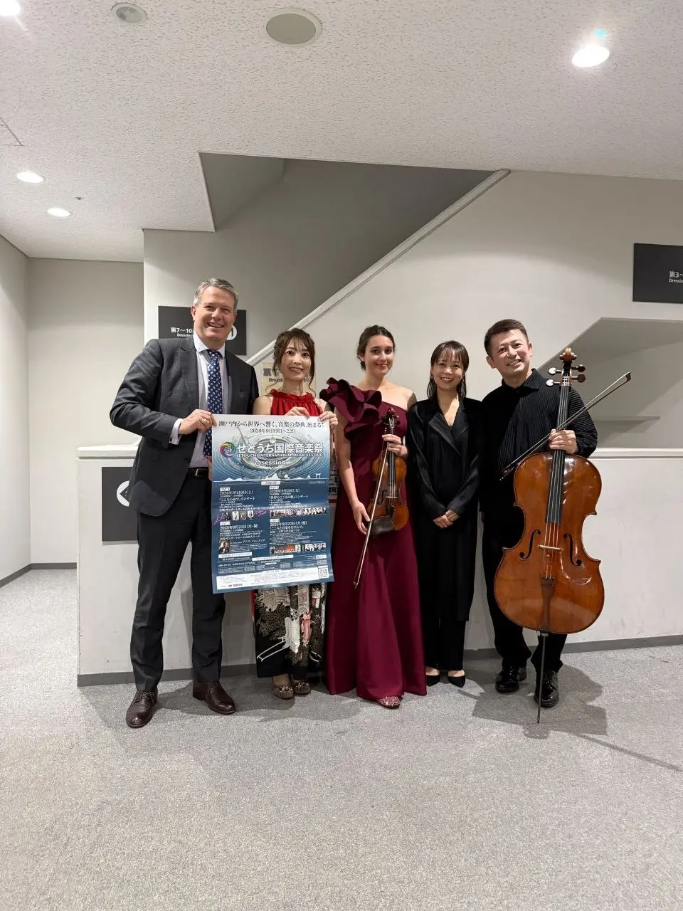
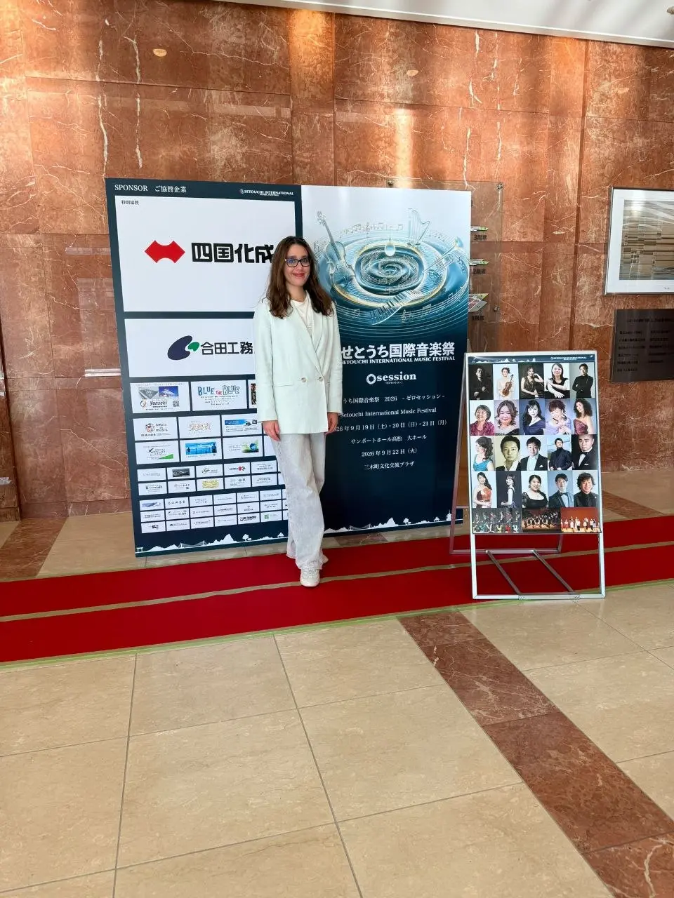
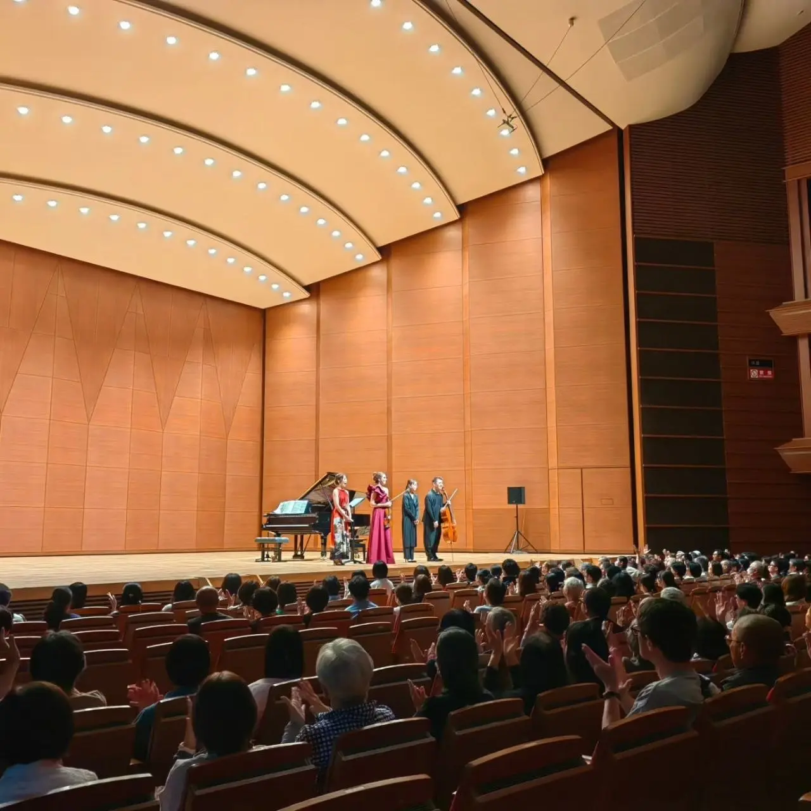
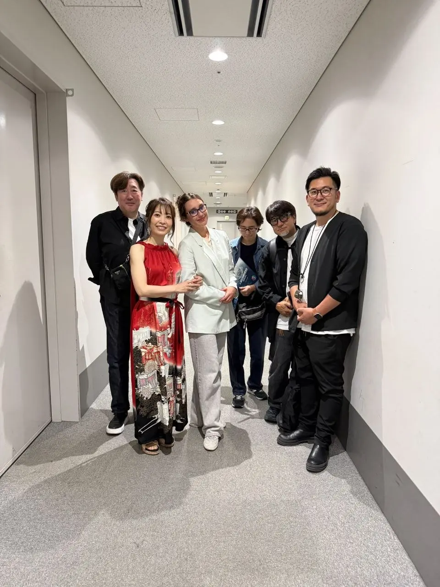
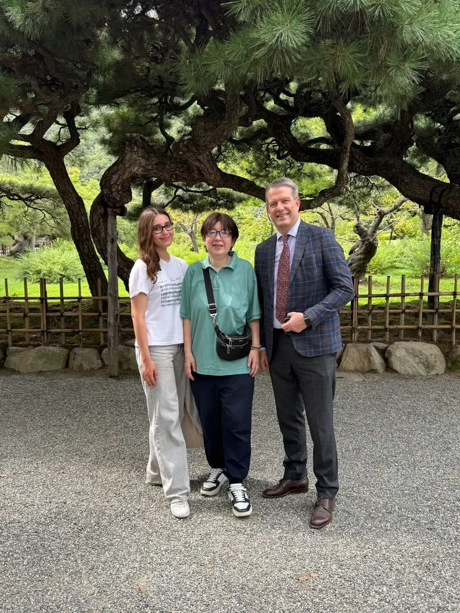
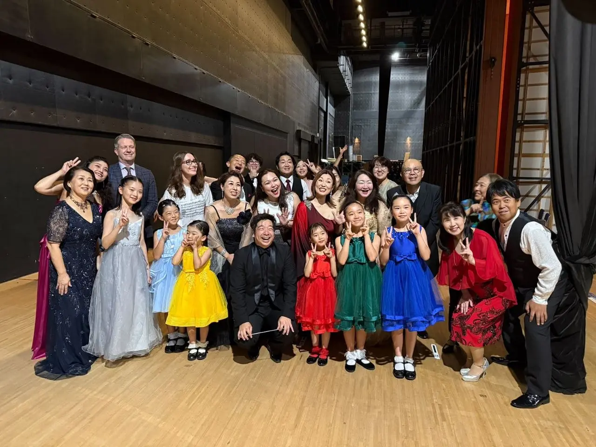
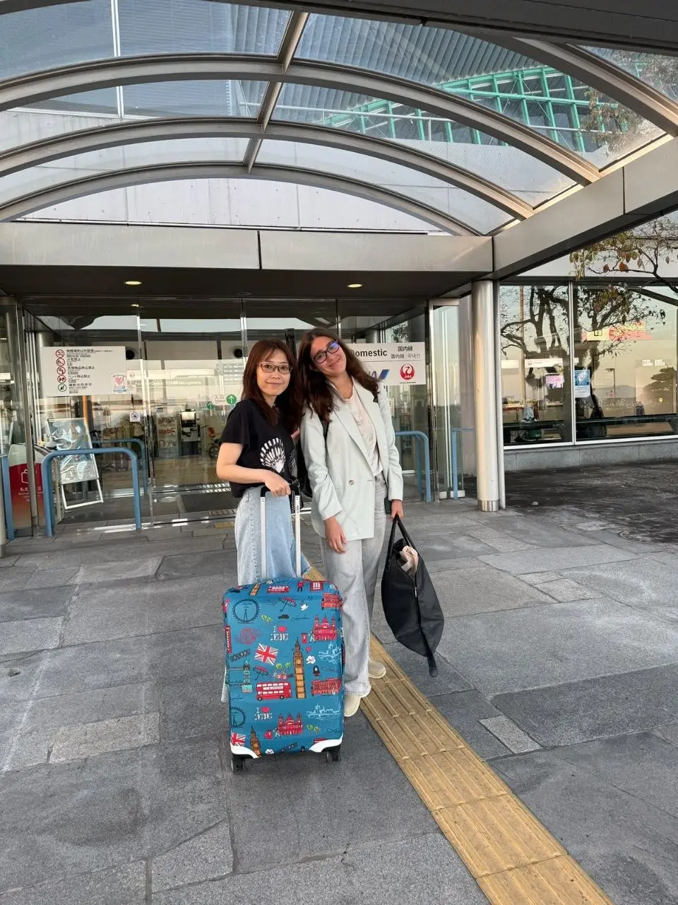
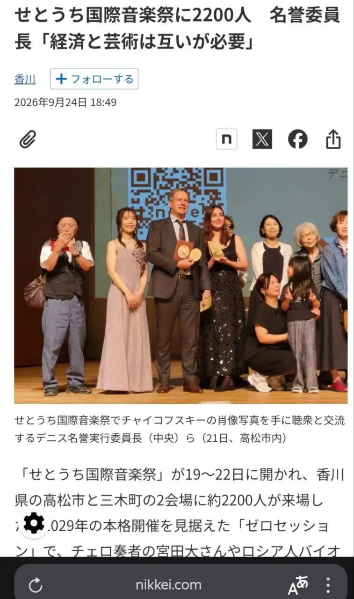
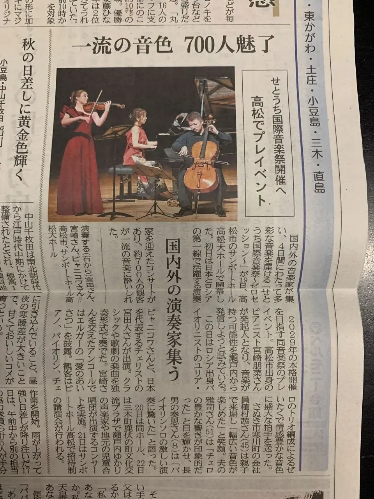
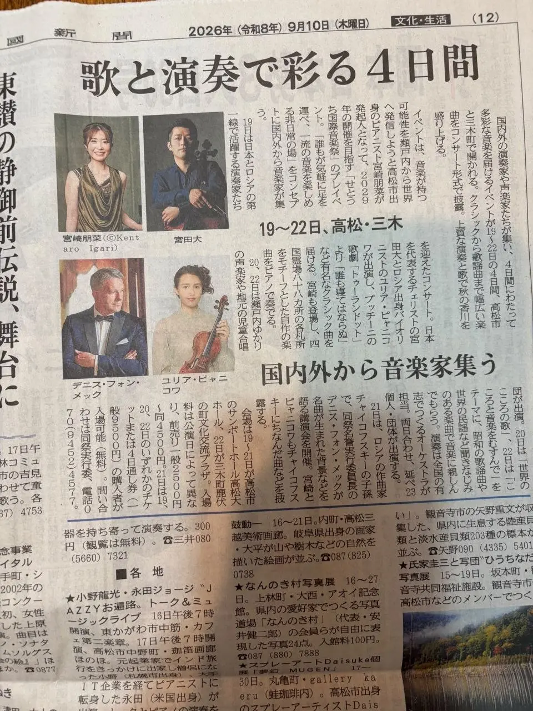

:::gallery
{width="960" height="1280" data-color="#8d837d"}

{width="960" height="1280" data-color="#97796c"}

{width="1280" height="1280" data-color="#875c3d"}

{width="960" height="1280" data-color="#9c938d"}

{width="960" height="1280" data-color="#636351"}

{width="1280" height="960" data-color="#604e42"}

{width="960" height="1280" data-color="#7e7e7b"}

{width="757" height="1280" data-color="#a0928a"}

{width="960" height="1280" data-color="#94897c"}

{width="960" height="1280" data-color="#a59c94"}
:::

«Тонкий, изящный звук скрипки разносился по залу, и это было великолепно»
—
Такие отзывы я получила после концертов.
🥺🥺🥺 Слушатели публикуют их в японской соцсети Ameblo.

Фестиваль освещали национальные и региональные издания, где также отметили моё выступление: крупнейшая экономическая газета Японии Nikkei, главная газета префектуры Кагава Shikoku Shimbun с более чем вековой историей, KSB News — крупнейшая телерадиокомпания региона, входящая в национальную сеть TV Asahi, Takamatsu Keizai Shimbun (городское интернет-издание о культуре и бизнесе Такамацу), а также интернет-ресурсы Yahoo! News Japan и сеть Minna no Keizai Shimbun Network.

Скрины и вырезки из статей прилагаю. 📸

Мне трудно передать, как много необыкновенных впечатлений случилось со мной за одну эту поездку — встречи, музыка, публика, которая слушала с открытым сердцем. И чувство, что музыка правда не знает границ.

Очень жду новый сезон фестиваля в 2029 году!!! 🎶

[{width="180" height="320" data-color="#699ace"}](https://t.me/gattavasis/714){.video data-duration="32"}
